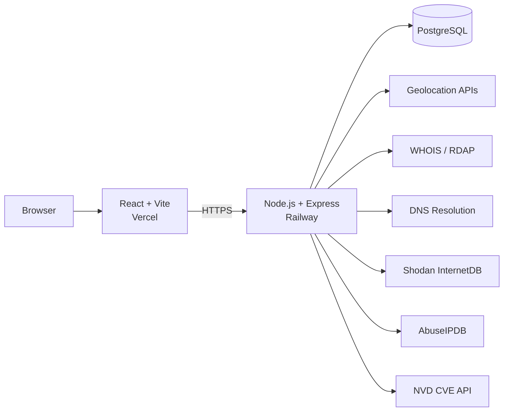

# SakhasHQ

A security-focused monorepo containing practical cybersecurity tools built around a simple idea: turn raw security data into information that is easier to investigate and understand.

## Projects

| Project | Description | Status |
|---|---|---|
| **OSINQUEST** | IP and domain OSINT lookup tool that aggregates geolocation, WHOIS/RDAP, DNS, open-port, and abuse-reputation data. | Live |
| **Raven Eyes** | CVE discovery and monitoring tool powered by the NVD API, with keyword search and severity filtering. | Live |

The applications share a single React frontend and Node.js/Express backend, while keeping each security tool separated by its own route and service layer.

## Live Demo

**OSINQUEST + Raven Eyes:**  
https://osinquest.vercel.app

## Architecture



The backend is organized around routes, services, utilities, and database access. External security data sources are isolated in service modules so the API layer does not need to understand each provider's raw response format.

## OSINQUEST

OSINQUEST is designed as a lightweight first-pass investigation tool for unfamiliar IP addresses and domains.

### What it provides

- IP and domain classification
- Geolocation
- WHOIS/RDAP information
- Forward and reverse DNS
- Open-port information through Shodan InternetDB
- Abuse reputation through AbuseIPDB
- Server-side result caching
- Search activity statistics
- JSON result export
- Interactive map and charts
- Graceful handling of unavailable third-party sources

A lookup fans out to multiple independent sources concurrently. If one provider fails, the API returns the remaining information instead of failing the entire lookup.

### Security controls

Security is treated as part of the application design rather than an afterthought.

- **Server-side input classification:** the backend determines whether an input is an IP or domain instead of trusting a client-provided type.
- **SSRF protection:** private, loopback, link-local, and reserved IP ranges are rejected before lookup processing.
- **Request rate limiting:** API requests are limited to protect both the application and third-party API quotas.
- **Fail-closed CORS:** requests are allowed only from configured client origins.
- **Payload limits:** JSON request bodies are capped to reduce unnecessary resource consumption.
- **Bounded external requests:** third-party operations use timeouts so a slow provider cannot hold a request indefinitely.
- **Graceful degradation:** individual provider failures are represented as errors in their corresponding result instead of crashing the complete lookup.
- **Graceful shutdown:** the server closes the HTTP server and PostgreSQL pool cleanly on termination signals.

## Raven Eyes

Raven Eyes provides a focused interface for discovering and monitoring Common Vulnerabilities and Exposures (CVEs).

### Features

- Recent CVE feed
- Severity filtering: Critical, High, Medium, and Low
- Keyword-based CVE search
- CVSS base score and severity
- CVSS vector information
- Exploitability score when available
- CVE publication and modification timestamps
- Selected references for further investigation
- PostgreSQL-backed result caching
- Separate cache lifetimes for search results and the recent-vulnerability feed

Raven Eyes consumes the NVD CVE 2.0 API and normalizes its response into a simpler structure for the frontend.

## Testing

The backend uses Jest and Supertest for API testing.

The test strategy covers areas such as:

- Input validation
- IP and domain classification
- SSRF protection
- API routes
- External-service failure handling
- Cache behavior
- CORS behavior
- Malformed JSON handling
- Rate limiting
- CVE search and feed behavior

External services are mocked during application tests so the test suite does not depend on live third-party API availability.

## Performance

The deployed OSINQUEST backend was load tested with k6 against the production API.

| Metric | Result |
|---|---:|
| Requests | 570 |
| Sustained throughput | ~11.2 req/s |
| Error rate | 0% |
| Average latency | ~45 ms |
| p95 latency | ~60.6 ms |
| Rate-limit test | 5 of 35 requests returned 429 |

The throughput test primarily exercised cached lookups, which demonstrates the benefit of the PostgreSQL caching layer for repeated queries.

> These are self-generated load-test results from the deployed application, not a benchmark against other OSINT platforms.

## Tech Stack

### Frontend

- React 19
- Vite
- Tailwind CSS
- React Router
- Axios
- Leaflet / React Leaflet
- Recharts
- Lucide React
- Zod
- Vercel Analytics

### Backend

- Node.js
- Express 5
- PostgreSQL
- node-fetch
- Zod
- Helmet
- CORS
- express-rate-limit
- Morgan

### Testing & Performance

- Jest
- Supertest
- Vitest
- k6

### Deployment

- Vercel
- Railway
- PostgreSQL

## Repository Structure

```text
SakhasHQ/
├── client/
│   ├── src/
│   │   ├── components/
│   │   ├── pages/
│   │   │   ├── Hub
│   │   │   ├── OsinQuest
│   │   │   └── RavenEyes
│   │   └── App.jsx
│   └── package.json
│
├── server/
│   ├── src/
│   │   ├── db/
│   │   ├── routes/
│   │   │   ├── lookup.js
│   │   │   └── raven-eyes.js
│   │   ├── services/
│   │   └── utils/
│   ├── tests/
│   ├── index.js
│   └── package.json
│
├── loadtest/
├── tests-output.md
└── package.json
```

## API

### OSINQUEST

| Endpoint | Method | Purpose |
|---|---|---|
| `/api/lookup` | POST | Aggregate IP/domain intelligence |
| `/api/lookup/activity` | GET | Return recent search activity |
| `/api/lookup/stats` | GET | Return total lookup count |

Example:

```json
{
  "query": "8.8.8.8"
}
```

### Raven Eyes

| Endpoint | Method | Purpose |
|---|---|---|
| `/api/raven-eyes/search` | POST | Search CVEs by keyword |
| `/api/raven-eyes/feed` | GET | Retrieve recent CVEs with optional severity filtering |
| `/health` | GET | Backend health check |

Example:

```json
{
  "keyword": "openssl"
}
```

## Getting Started

### Prerequisites

- Node.js
- npm
- PostgreSQL
- An AbuseIPDB API key for abuse-reputation data (optional)
- An NVD API key for improved NVD rate limits (optional)

### 1. Clone

```bash
git clone https://github.com/sakh9/SakhasHQ.git
cd SakhasHQ
```

### 2. Backend

```bash
cd server
npm install
```

Create a `.env` file:

```env
DATABASE_URL=your_postgresql_connection_string
CLIENT_URL=http://localhost:5173

ABUSEIPDB_KEY=
NVD_API_KEY=

RATE_LIMIT_MAX=30
RATE_LIMIT_WINDOW_MS=900000
LOOKUP_CACHE_TTL_HOURS=24
```

Initialize the database using the schema in:

```text
server/src/db/schema.sql
```

Then start the server:

```bash
npm run dev
```

The backend runs on port `5000` by default, or the port supplied by `PORT`.

### 3. Frontend

Open another terminal:

```bash
cd client
npm install
```

Create `client/.env`:

```env
VITE_API_URL=http://localhost:5000
```

Start Vite:

```bash
npm run dev
```

## Design Philosophy

SakhasHQ is intentionally not built as a large all-in-one intelligence platform.

The goal is to demonstrate practical engineering and cybersecurity fundamentals:

1. Collect data from multiple sources.
2. Normalize inconsistent external responses.
3. Validate untrusted input.
4. Protect backend integrations from abuse.
5. Cache expensive or rate-limited operations.
6. Handle partial failures gracefully.
7. Test security-sensitive behavior.
8. Measure the deployed system instead of relying only on local development performance.

## Roadmap

- [ ] Move rate-limit state from memory to Redis
- [ ] Add centralized error monitoring
- [ ] Add uptime monitoring
- [ ] Improve WHOIS/RDAP retry handling
- [ ] Add automated GitHub Actions CI
- [ ] Expand Raven Eyes with additional vulnerability filtering and analysis
- [ ] Add more security-oriented tools to SakhasHQ

## License

MIT

---

Built by **Sakha** as a practical cybersecurity and software-engineering portfolio project.
