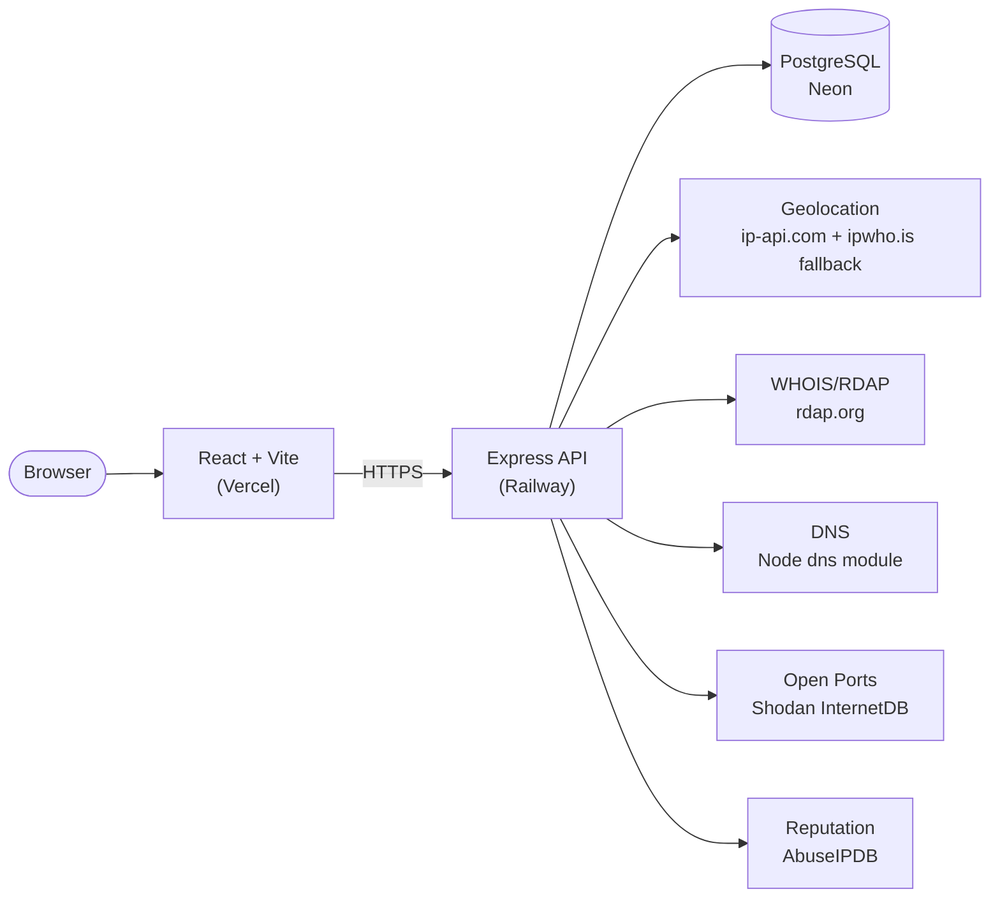

# OSINQUEST

A lightweight safety check for an unfamiliar IP address or domain — before you click it, connect to it, or trust it.

**[Live demo →](https://osinquest.vercel.app)**


---

## Why this exists

Most OSINT lookup tools — Shodan, Censys, VirusTotal — compete on data breadth: more sources, more fields, more raw JSON to interpret yourself. This project deliberately doesn't try to compete on that axis. Instead, its one real differentiator is a **plain-English Risk Summary**: instead of five separate cards of geolocation, port, and abuse data, it synthesizes them into a sentence or two —

> *"This IP is hosted by DigitalOcean in Frankfurt, Germany. 6 open ports detected (22, 80, 443, 3306, 8080, …). Moderate abuse risk — 42% confidence from 7 reports. Worth a closer look."*

The goal was a tool that *interprets*, not just displays — and a codebase that demonstrates real engineering judgment (input validation, graceful degradation, tested security controls) rather than feature breadth.

<!-- Add 1-2 screenshots or a short GIF here: the search + risk summary banner, and the map/chart view -->

---

## Architecture



Every lookup fans out to 5 independent data sources concurrently, each with its own 8-second timeout. A failed or slow source degrades gracefully — the request still succeeds, with that one field labeled as unavailable rather than the whole response failing.

---

## Features

**Analysis**
- Plain-English Risk Summary synthesizing geolocation, open ports, and abuse data
- IP and domain lookups: geolocation, WHOIS/RDAP, DNS (forward + reverse), open ports (Shodan InternetDB), abuse reputation (AbuseIPDB)
- 24-hour result caching to avoid re-hitting free-tier API quotas on repeat queries

**Visualizations**
- Interactive dark-themed map (Leaflet) with correct recentering across searches
- Radial abuse-confidence gauge
- 14-day search activity chart
- DNS record-count-by-type chart

**Quality of life**
- Recent searches (persisted locally, no account needed)
- One-click example queries for first-time visitors
- Copy/download full result as JSON
- Live "total lookups performed" counter

---

## Security design decisions

These were deliberate choices, not defaults — worth calling out explicitly since they're a big part of the point of building this as a cybersecurity-adjacent project:

- **The server never trusts a client-declared input type.** An earlier version accepted `{ query, type }` from the frontend; the type is now derived and validated server-side (`classifyQuery()`), since trusting client-supplied metadata that determines which backend code path runs is a common source of real vulnerabilities.
- **SSRF protection on every request.** Private, loopback, link-local, and cloud-metadata IP ranges (`10.0.0.0/8`, `127.0.0.1`, `169.254.169.254`, etc.) are rejected before any external API call is made. Without this, a public lookup tool that proxies requests to third-party services can be turned into a probe against internal infrastructure.
- **Every external call has a bounded timeout.** One slow third-party API can't hang the whole request — each of the 5 data sources times out independently and reports a labeled error instead of stalling the response.
- **Rate limiting protects both this server and the free-tier APIs it depends on** (30 requests/15 min per IP by default, configurable via environment variables for controlled load testing without weakening production).
- **CORS fails closed, not open.** A missing `CLIENT_URL` configuration blocks all origins rather than defaulting to `*` — the safer direction for a misconfiguration to fail in.

---

## Testing

**67 tests across 5 suites, 93–100% statement coverage**, run with Jest + Supertest. All external calls (HTTP fetch, DNS resolution, database) are mocked — the suite has zero dependency on live third-party API availability.

```
Test Suites: 5 passed, 5 total
Tests:       67 passed, 67 total
```

Coverage spans input validation and the SSRF guard, all 5 external service integrations (including primary/fallback failover logic), the full lookup route (caching, graceful degradation, partial-failure handling), and app-level middleware (CORS, error handling, malformed request bodies).

One real bug the test suite caught during development: input normalization was silently truncating IPv6 addresses (`fe80::1` → `fe80:`) because a "strip the trailing port" regex couldn't distinguish a port suffix from an IPv6 address's own last segment. Fixed and covered by regression tests.

---

## Performance (self-generated load test results)

Load tested the deployed production backend with [k6](https://k6.io), against real external APIs (not mocked):

| | Result |
|---|---|
| Sustained throughput | ~11.2 req/s over 570 requests, 0% errors |
| Latency (mixed cache hit/miss workload) | avg 45ms, p95 60.6ms |
| Rate limiting under load | 5 of 35 requests correctly rejected (429) once the 30-req/15-min threshold was exceeded |

The low latency reflects the effectiveness of the 24-hour caching layer — most requests in a sustained test against a small query set are cache hits. A cold WHOIS/RDAP lookup alone can take 1–2 seconds; the cache is what makes repeat lookups fast.

---

## API reference

| Endpoint | Method | Description |
|---|---|---|
| `/api/lookup` | POST | `{ "query": "8.8.8.8" }` → full aggregated result |
| `/api/lookup/activity` | GET | Daily search counts, last 14 days |
| `/api/lookup/stats` | GET | All-time total lookups performed |
| `/health` | GET | Liveness check |

---

## Tech stack

| Layer | Choice |
|---|---|
| Frontend | React (Vite), Tailwind CSS, Recharts, Leaflet |
| Backend | Node.js, Express |
| Database | PostgreSQL (Neon) |
| Testing | Jest, Supertest, k6 |
| Hosting | Vercel (frontend), Railway (backend) |

---

## Running locally

```bash
# Backend
cd server
npm install
cp .env.example .env   # fill in DATABASE_URL, ABUSEIPDB_KEY (optional), CLIENT_URL
node src/db/init.js    # creates tables from schema.sql
npm run dev

# Frontend
cd client
npm install
echo "VITE_API_URL=http://localhost:5000" > .env
npm run dev
```

**Environment variables (backend)**

| Variable | Required | Notes |
|---|---|---|
| `DATABASE_URL` | Yes | Postgres connection string |
| `CLIENT_URL` | Yes | Frontend origin(s), comma-separated |
| `ABUSEIPDB_KEY` | No | Falls back to a "skipped" result if unset |
| `RATE_LIMIT_MAX` | No | Defaults to 30 |
| `RATE_LIMIT_WINDOW_MS` | No | Defaults to 900000 (15 min) |

---

## What I'd do with more time

- Move rate-limit state to Redis (currently in-memory, which resets on every redeploy and wouldn't work correctly across multiple server instances)
- Add Sentry for error tracking and UptimeRobot for uptime monitoring in production
- A WHOIS-specific retry (its two-hop bootstrap-then-registry lookup is meaningfully slower and less reliable than the other single-hop sources)
- GitHub Actions CI to run the test suite automatically on every push

---

## License

MIT
